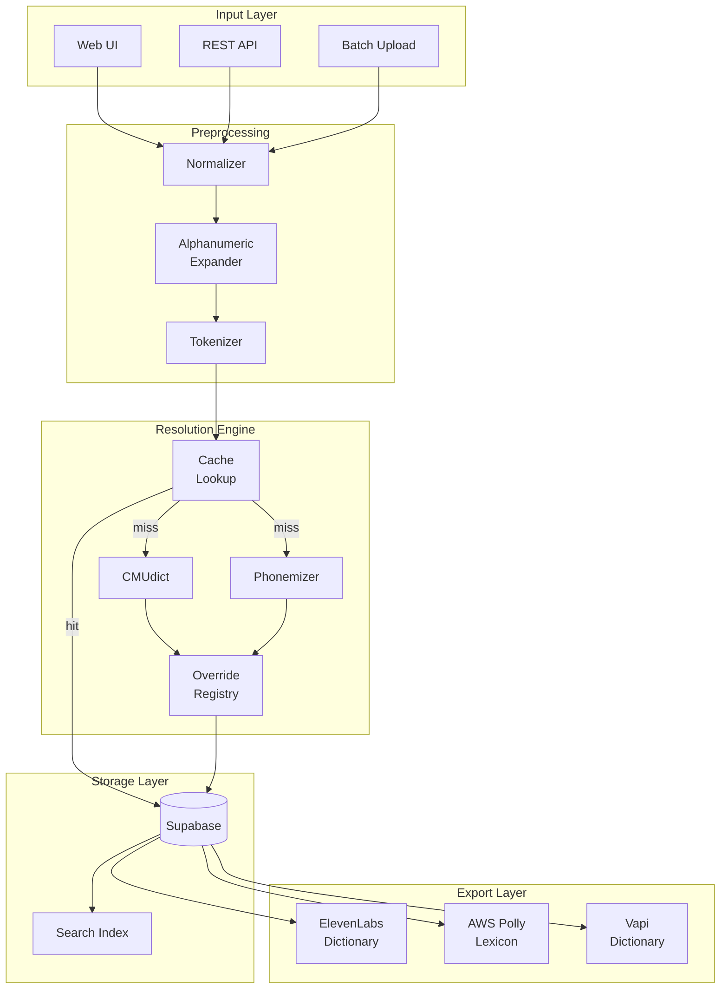
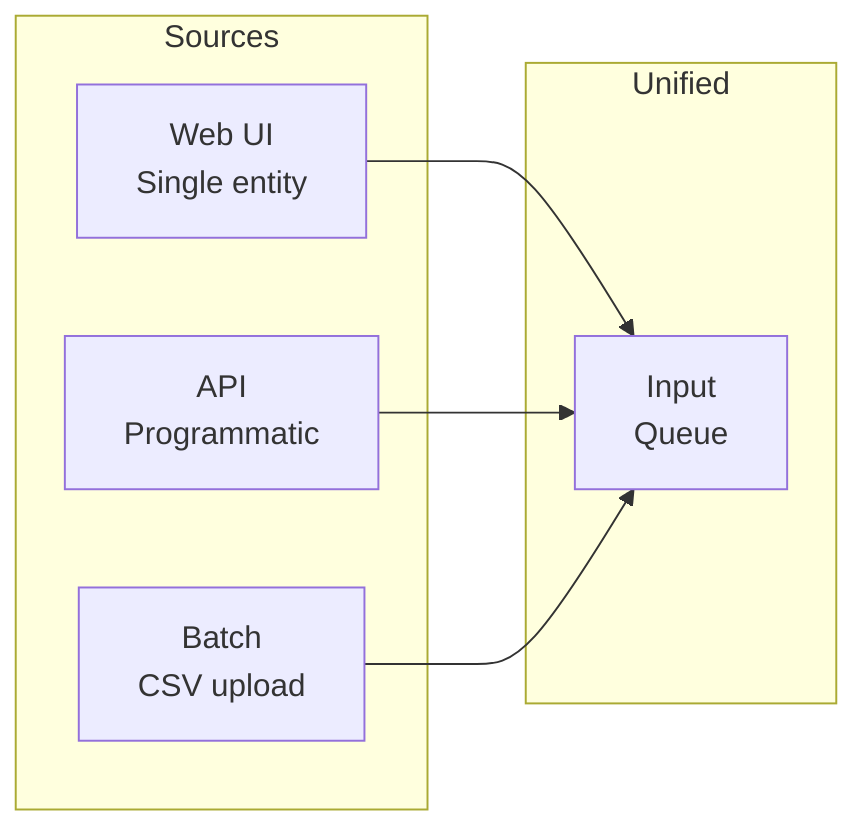
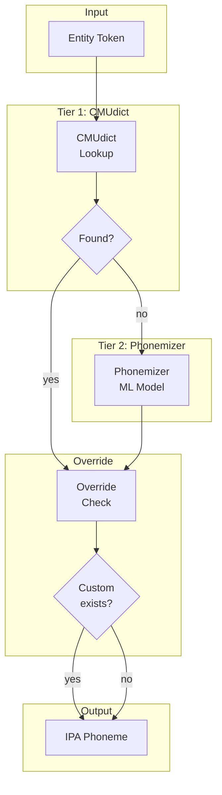
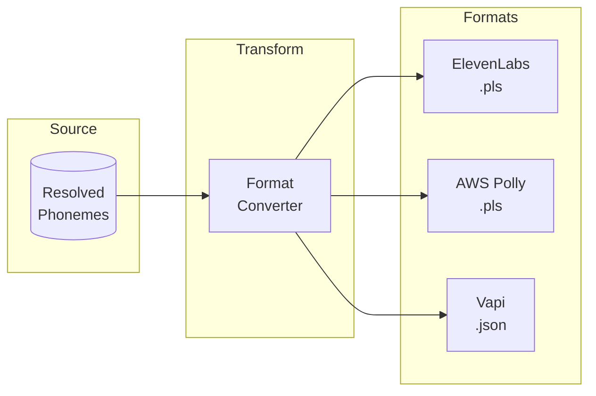
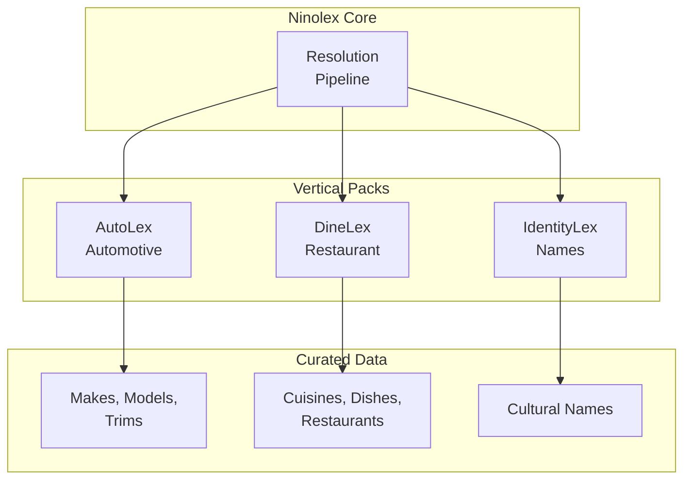

# Ninolex Pronunciation Resolution Pipeline

## Overview

Ninolex provides a pronunciation resolution pipeline that transforms arbitrary text entities into IPA (International Phonetic Alphabet) phonemes, then exports to TTS-engine-specific dictionary formats.

## Pipeline Architecture



## Pipeline Stages

### Stage 1: Input

Multiple input methods converge to the same pipeline:



### Stage 2: Preprocessing

```mermaid
flowchart LR
    subgraph Raw
        IN[Raw Input<br/>"BMW  X5"]
    end

    subgraph Normalize
        N1[Trim whitespace]
        N2[Normalize unicode]
        N3[Case handling]
    end

    subgraph Expand
        E1[Detect alphanumeric]
        E2[Expand patterns]
        E3["WH-1000XM5" →<br/>"W H one thousand X M five"]
    end

    subgraph Tokenize
        T1[Split into units]
        T2[Identify boundaries]
    end

    IN --> N1 --> N2 --> N3
    N3 --> E1 --> E2 --> E3
    E3 --> T1 --> T2
```

**Alphanumeric expansion examples:**

| Input | Expanded |
|-------|----------|
| BMW X5 | B M W X five |
| WH-1000XM5 | W H one thousand X M five |
| iPhone 15 | iPhone fifteen |
| A4 | A four |

### Stage 3: Resolution

Two-tier resolution with fallback:



**Resolution sources:**

| Source | Speed | Accuracy | Coverage |
|--------|-------|----------|----------|
| CMUdict | Fast (<10ms) | High | Standard English |
| Phonemizer | Slower (~100ms) | Good | Novel entities |
| Override | Instant | Perfect | Manual entries |

### Stage 4: Export

Engine-specific dictionary generation:



**Export format examples:**

ElevenLabs/Polly (W3C PLS):
```xml
<lexicon>
  <lexeme>
    <grapheme>BMW</grapheme>
    <phoneme>biː ɛm ˈdʌbəljuː</phoneme>
  </lexeme>
</lexicon>
```

Vapi (JSON):
```json
{
  "words": [
    {
      "word": "BMW",
      "pronunciation": "biː ɛm ˈdʌbəljuː"
    }
  ]
}
```

## Vertical Pack Architecture



**Vertical isolation:** Each pack operates independently, enabling parallel development.

## API Contract

```yaml
# POST /api/v1/resolve
Request:
  entities:
    - "BMW X5"
    - "Mercedes-Benz"
    - "WH-1000XM5"
  format: "elevenlabs"

Response:
  results:
    - grapheme: "BMW X5"
      phoneme: "biː ɛm ˈdʌbəljuː ɛks faɪv"
      source: "cmudict"
      confidence: 0.95
    - grapheme: "Mercedes-Benz"
      phoneme: "mərˈseɪdiz bɛnz"
      source: "cmudict"
      confidence: 0.92
    - grapheme: "WH-1000XM5"
      phoneme: "ˈdʌbəljuː eɪtʃ wʌn ˈθaʊzənd ɛks ɛm faɪv"
      source: "expansion+cmudict"
      confidence: 0.88
  export:
    format: "elevenlabs"
    download_url: "/exports/req_xxx.pls"
```

## Related Documents

- [Ninolex Case Study](../case-studies/ninolex.md)
- [ADR-003: API-First Surface](../adrs/003-api-first-surface.md)
- [Ninolex-GH Repository](https://github.com/iamnortey/ninolex-gh)
