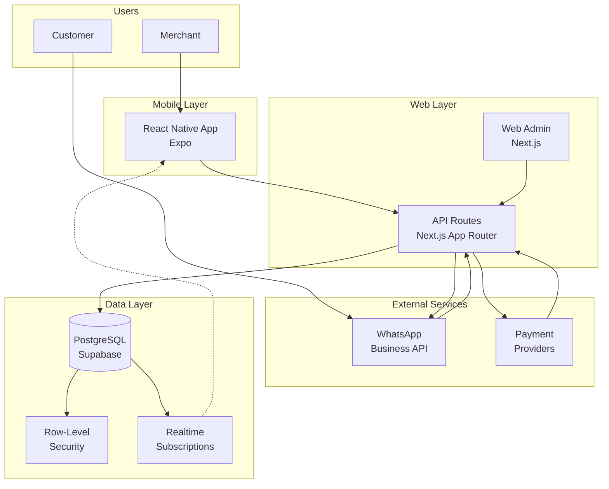
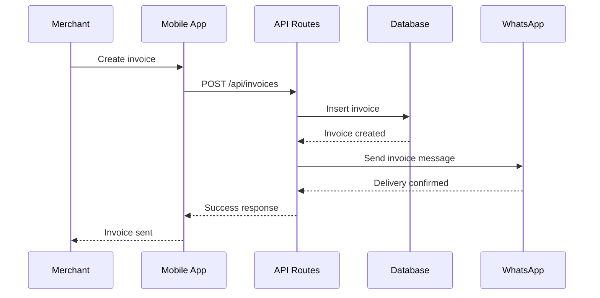
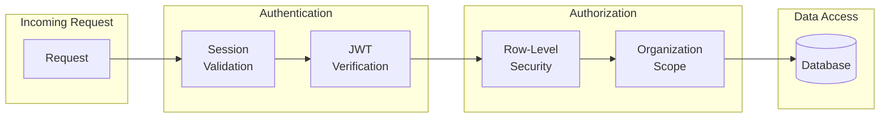

# Ojanaa System Architecture

## Overview

Ojanaa is a WhatsApp-native POS super-app built with a monorepo architecture. The system consists of a mobile app (Expo), web admin (Next.js), and a shared database layer (Supabase).

## System Diagram

## Component Details

### Mobile App (apps/app)
- **Technology:** React Native with Expo
- **Purpose:** Merchant interface for creating invoices, managing orders
- **Real-time:** Supabase Realtime for instant updates
- **Offline:** (Planned) Queue transactions when connectivity is poor

### Web Admin (apps/web)
- **Technology:** Next.js App Router
- **Purpose:** Dashboard for analytics, settings, admin functions
- **API Routes:** All backend logic lives in `apps/web/src/app/api/*`

### API Layer
- **Pattern:** Single backend surface (no separate API service)
- **Auth:** Supabase Auth with session validation
- **Webhooks:** Idempotent handlers for WhatsApp and payment providers

### Data Layer
- **Database:** PostgreSQL via Supabase
- **Security:** Row-Level Security (RLS) on all tables
- **Isolation:** Organization-scoped data access
- **Real-time:** Supabase Realtime for live updates

### External Integrations
- **WhatsApp Business API:** Invoice delivery, customer communication
- **Payment Providers:** Mobile Money, card payments

## Data Flow: Invoice Creation

## Security Architecture

**Security layers:**
1. **Session validation:** Every request validates user session
2. **JWT verification:** Token integrity checked
3. **RLS policies:** Database enforces organization scope
4. **Organization isolation:** Users only access their org's data

## Key Architectural Decisions

| Decision | Rationale |
|----------|-----------|
| Single backend surface | Reduces operational complexity |
| Monorepo structure | Shared types, coordinated deployments |
| RLS by default | Defense in depth |
| Idempotent webhooks | Safe retries from external services |
| Real-time subscriptions | Instant updates without polling |

## Related Documents

- [Trust Loop Flow](./ojanaa-trust-loop.md)
- [ADR-001: Phase-Gated Development](../adrs/001-phase-gated-development.md)
- [ADR-002: Idempotent Webhooks](../adrs/002-idempotent-webhooks.md)
