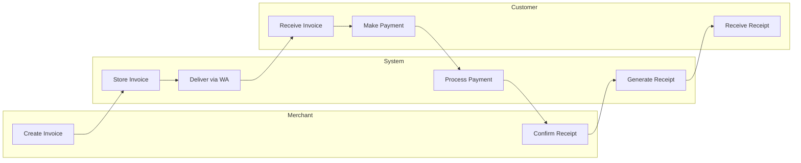
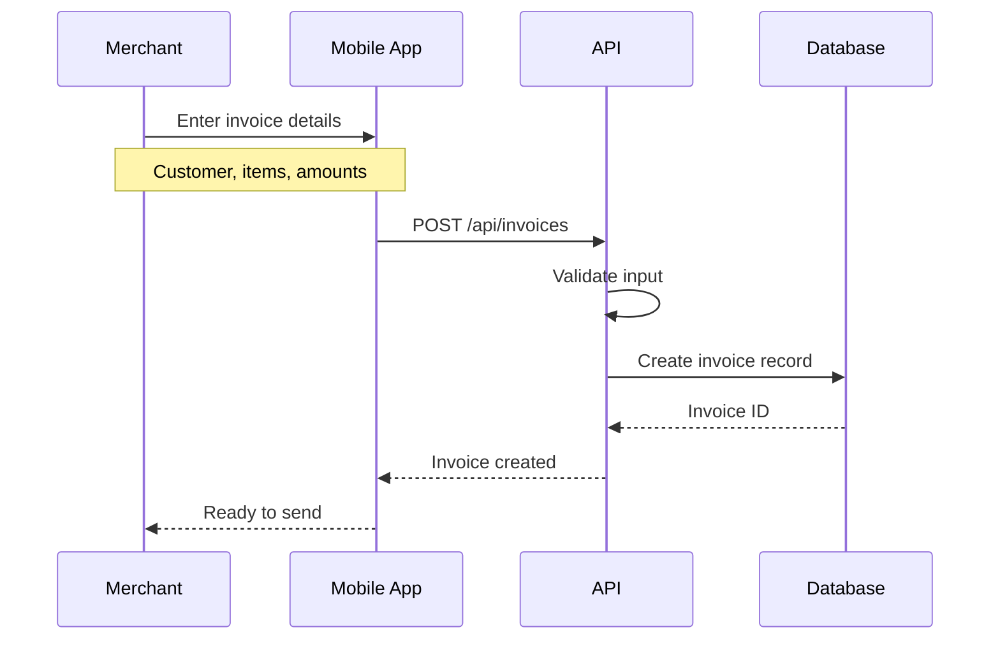
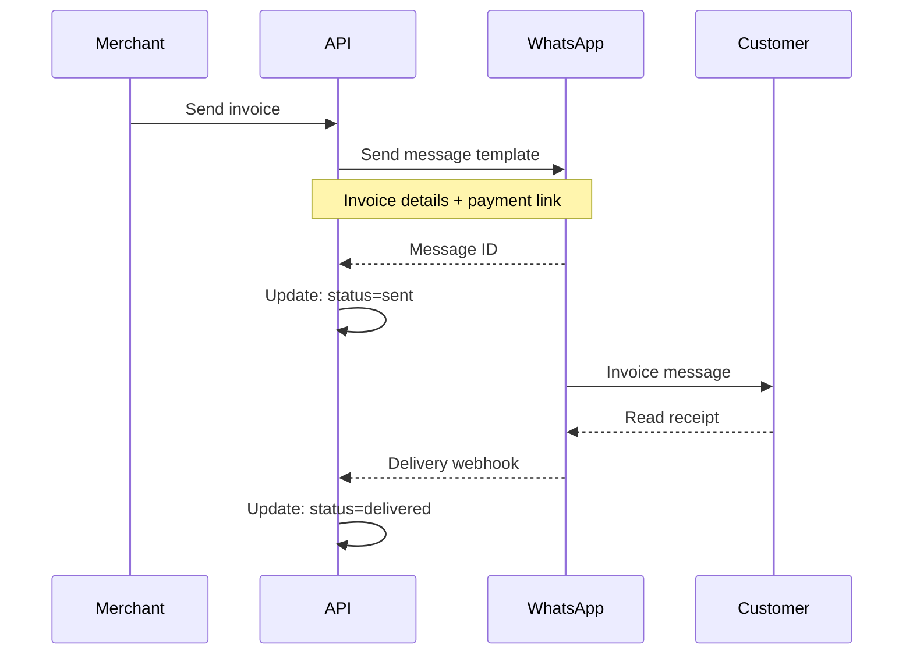
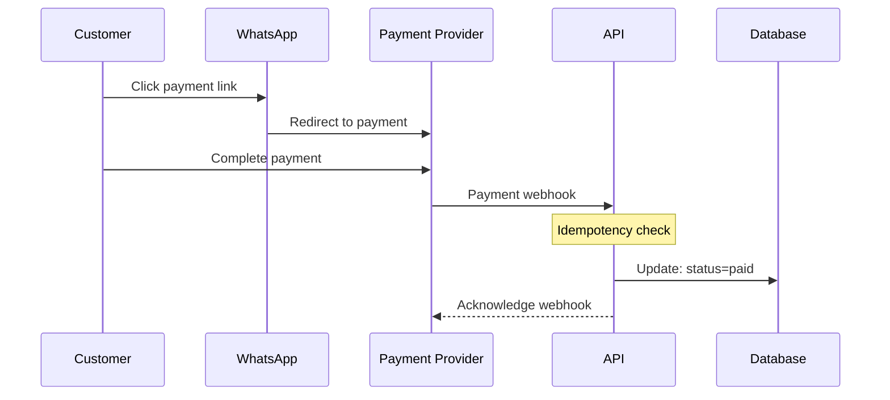
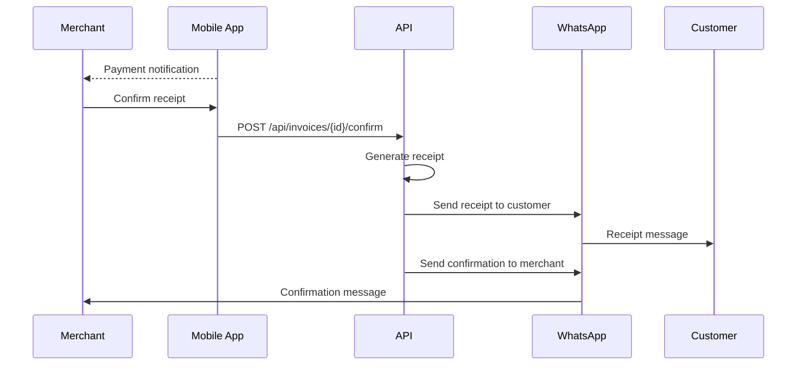
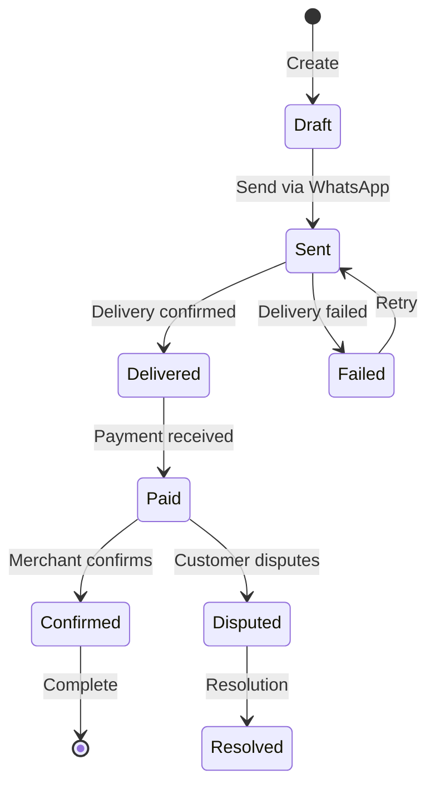

# Ojanaa Invoice Trust Loop

## Overview

The Trust Loop is the core flow of Ojanaa: a verifiable transaction cycle that creates mutual proof between merchant and customer.

## The Trust Problem

In informal commerce:
- Customers dispute payments they actually made
- Merchants claim deliveries they didn't make
- Neither party has proof
- Trust is low, transactions are risky

## The Solution: Trust Protocol

## Detailed Flow

### Phase 1: Invoice Creation

### Phase 2: Invoice Delivery

### Phase 3: Payment

### Phase 4: Confirmation & Receipt

## State Machine

## Trust Evidence

Each state transition creates evidence:

| State | Evidence Created |
|-------|------------------|
| Draft → Sent | Timestamp, WA message ID |
| Sent → Delivered | Delivery receipt from WA |
| Delivered → Paid | Payment provider confirmation |
| Paid → Confirmed | Merchant confirmation timestamp |
| Confirmed → Complete | Receipt sent, mutual acknowledgment |

## Why This Works

1. **Third-party timestamps:** WhatsApp and payment providers provide independent proof
2. **Immutable records:** State transitions are logged, not overwritten
3. **Mutual receipts:** Both parties receive proof at each step
4. **Dispute resolution:** Clear evidence chain for any disputes

## Related Documents

- [System Architecture](./ojanaa-system.md)
- [Ojanaa Case Study](../case-studies/ojanaa.md)
- [ADR-002: Idempotent Webhooks](../adrs/002-idempotent-webhooks.md)
