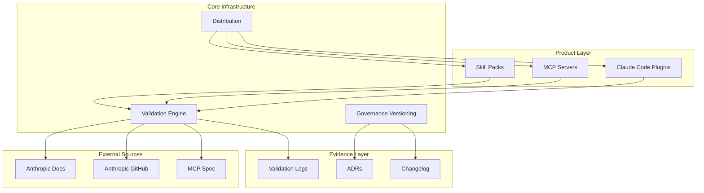

# Ninobyte: Enterprise Tooling for Claude Agent Ecosystems

## 1. Executive Summary

Ninobyte provides enterprise-grade education and tooling for Anthropic/Claude agent ecosystems. It delivers verified, secure, and reproducible skill packs, MCP servers, and Claude Code plugins—with full validation trails and governance documentation.

**Stack:** Python, Claude Skills, MCP Servers, Claude Code Plugins

**Status:** Active development with published products

---

## 2. The Pain Point

Developers building Claude-powered agents face several challenges:

1. **Sparse documentation:** Official docs are improving but incomplete for advanced use cases
2. **Unverified tutorials:** Most examples are blog posts that may be outdated or wrong
3. **No enterprise patterns:** Security-conscious organizations need auditable agent tooling
4. **Fragmented ecosystem:** Skills, MCP, and Claude Code plugins have different patterns

The result: developers waste time reverse-engineering patterns, and enterprises hesitate to adopt Claude agents due to governance concerns.

---

## 3. The Solution

Ninobyte provides a **validation-first approach** to Claude ecosystem tooling:

```
Official Docs → Validation → Implementation → Evidence Trail
      ↓              ↓             ↓               ↓
  Anthropic      Cross-ref      Build with      Every claim
  sources        against        documented      traceable to
                 spec           patterns        source
```

**Key capabilities:**
- Skill packs with verified patterns
- MCP server templates
- Claude Code plugins
- Governance documentation
- Validation logs tracing claims to official sources

---

## 4. Architecture



**Key architectural decisions:**
- **Validation-first:** Every skill is validated against official Anthropic documentation
- **Evidence receipts:** All decisions link back to canonical documentation
- **Governance versioning:** Explicit versioning for all governance documents

---

## 5. Key Engineering Decisions

### Validation-First Development
**Decision:** Every skill and plugin validated against official Anthropic sources before release

**Tradeoff:** Slower development, requires continuous monitoring of official docs

**Rationale:** Enterprise trust requires provenance. "Works for me" isn't good enough when compliance is involved.

### ADR System
**Decision:** Architecture Decision Records for all significant choices

**Tradeoff:** Documentation overhead

**Rationale:** Decisions made today need to be understandable months later. ADRs capture the context and reasoning.

### Governance Versioning
**Decision:** Semantic versioning for governance documents, not just code

**Tradeoff:** More process to manage

**Rationale:** When policies change, stakeholders need to know what changed and why.

### Vertical Playbook
**Decision:** Target 9 specific verticals rather than generic tooling

**Tradeoff:** Less flexibility, more focused value proposition

**Rationale:** "AI for everyone" is marketing. "AI for SRE incident response" is a product.

---

## 6. Security & Privacy

### Security Policy
- Documented in SECURITY.md
- Vulnerability reporting process
- Threat model references

### Code Security
- No secrets in codebase
- Validation of all external inputs
- Sandboxed execution patterns for skills

### Distribution Security
- Signed releases where applicable
- Checksum verification
- Clear provenance for all artifacts

---

## 7. Reliability & Ops

### CI/CD
- GitHub Actions for continuous integration
- Automated testing on all PRs
- Automated releases via release.yml

### Documentation Standards
- Every product has README, CHANGELOG, and installation docs
- Validation logs for all official source checks
- Runbooks for operational procedures

### Quality Gates
- Code review required for all changes
- Validation against official docs required for claims
- Changelog entry required for releases

---

## 8. Performance & Scalability

### Skill Performance
- Skills designed for minimal latency
- Avoid blocking operations in hot paths
- Async patterns where appropriate

### Distribution
- Static hosting for documentation
- GitHub Releases for artifacts
- Claude Code marketplace integration (where available)

---

## 9. Impact & Metrics

| Metric | Value |
|--------|-------|
| Lines of Python | 996K+ |
| Validation entries | 10+ |
| ADRs documented | 5+ |
| CI workflows | 2 (ci + release) |
| Products | 3 (Skills, MCP, Plugins) |
| Target verticals | 9 |

### Products

| Product | Description | Status |
|---------|-------------|--------|
| **Senior Developer's Brain** | Job system for enterprise software engineering | Released |
| **MCP Server Templates** | Boilerplate for MCP server development | Development |
| **Claude Code Plugins** | Extensions for Claude Code | Released |

---

## 10. Demo

### Skill Pack Structure

```
skills/
├── senior-developer-brain/
│   ├── SKILL.md           # Skill definition
│   ├── README.md          # Documentation
│   ├── CHANGELOG.md       # Version history
│   └── modes/
│       ├── architecture-review.md
│       ├── implementation-planning.md
│       ├── code-review.md
│       ├── incident-triage.md
│       └── adr-writer.md
```

### Validation Log Example

```markdown
### VL-20251219-002

**Date**: 2025-12-19
**Author**: Claude Agent
**Topic**: Official Anthropic specifications for Skills

**Sources Checked**:
- GitHub: https://github.com/anthropics/skills
- MCP Specification: https://spec.modelcontextprotocol.io/

**Findings**:
1. Claude Skills format confirmed via anthropics/skills repo
2. MCP server specification validated
3. Claude Code plugin structure documented

**Status**: VALIDATED

**Action Required**:
- Update marketplace.json with validated schema
- Update installation docs with validated instructions
```

### Governance Versioning

```yaml
governance_version: "1.0.0"
enforced_by: "CLAUDE.md Director Rulebook"
plugins_required:
  - security-scanning
  - comprehensive-review
audit_trail: "ops/evidence/"
```

---

## 11. What I'd Improve Next

1. **Automated validation:** Script that checks claims against current official docs
2. **More verticals:** Expand beyond SRE to legal, healthcare, finance
3. **Community contributions:** Allow external validation entries with review
4. **Certification program:** Formalize skill verification for enterprise buyers
5. **Integration testing:** End-to-end tests of skills in Claude Code environment

---

## 12. Repo Access Note

The core implementation of Ninobyte is in a **private repository** to protect business strategy and product roadmaps.

This case study and the [ninobyte-docs](https://github.com/iamnortey/ninobyte-docs) repository contain:
- Architecture documentation
- Governance patterns
- ADR examples
- Validation methodology

For product access or partnership inquiries, please reach out directly.
