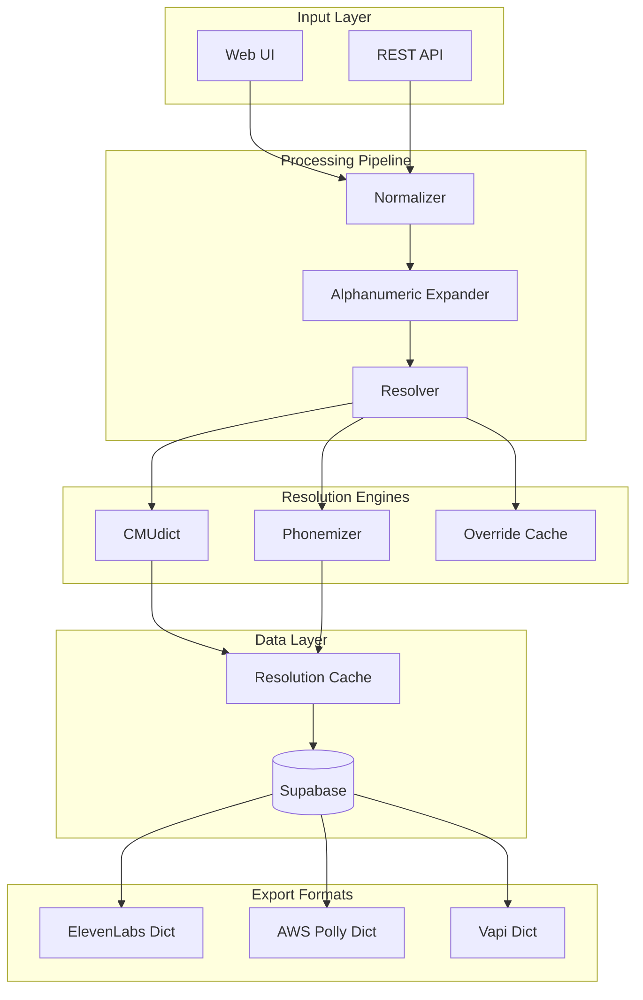

# Ninolex: Pronunciation Infrastructure for AI Voice

## 1. Executive Summary

Ninolex is production-grade infrastructure that provides a cross-platform source of truth for how real-world entities should be pronounced in AI voice applications. Modern TTS engines produce realistic voices but routinely mispronounce brands, products, names, and domain terms. Ninolex solves this.

**Stack:** TypeScript, Python, Next.js, Supabase, Modal (serverless), CMUdict, Phonemizer

**Status:** Active development with API in production use

---

## 2. The Pain Point

Modern TTS engines (ElevenLabs, OpenAI, AWS Polly) have a critical flaw:

1. **Brand mispronunciation:** "BMW" might be read as "bee-em-double-you" instead of the expected pronunciation
2. **Product names:** "WH-1000XM5" (Sony headphones) becomes gibberish
3. **Domain terminology:** Medical, legal, and automotive terms are frequently wrong
4. **Names:** Cultural names from non-English backgrounds are butchered

The result: voice AI applications sound unprofessional, lose user trust, and require expensive manual correction.

---

## 3. The Solution

Ninolex provides a **pronunciation resolution pipeline**:

```
Input Text → Normalize → Expand → Resolve → Export
     ↓           ↓          ↓         ↓        ↓
  "BMW X5"   Cleanup    Split    CMUdict   ElevenLabs
            whitespace  tokens   + Phon-   AWS Polly
                                 emizer    Vapi dict
```

**Key capabilities:**
- Web UI for instant dictionary generation
- REST API for programmatic resolution
- Multi-engine export (ElevenLabs, AWS Polly, Vapi)
- Alphanumeric expansion ("WH-1000XM5" → "W H one thousand X M five")
- Vertical packs for domain-specific entities

---

## 4. Architecture



**Key architectural decisions:**
- **Two-tier resolution:** CMUdict for high-confidence English, Phonemizer fallback for unknowns
- **Caching layer:** Supabase stores resolved pronunciations to avoid re-computation
- **Vertical isolation:** Each vertical pack (AutoLex, DineLex) operates independently

See [full architecture diagram](../architecture/ninolex-pipeline.md)

---

## 5. Key Engineering Decisions

### Two-Tier Pronunciation Resolution
**Decision:** CMUdict first (fast, reliable for standard English), Phonemizer fallback (handles unknowns)

**Tradeoff:** Two codepaths to maintain, but better accuracy than either alone

**Rationale:** CMUdict is authoritative for known words. Phonemizer uses ML models that can handle novel entities but are slower and sometimes wrong.

### Alphanumeric Expansion
**Decision:** Pre-process alphanumeric strings before resolution

**Tradeoff:** Additional processing step, custom rules for different patterns

**Rationale:** "WH-1000XM5" is unpronounceable as a word. Expanding to "W H one thousand X M five" gives TTS engines something they can actually say.

### Vertical Pack Architecture
**Decision:** Each vertical (automotive, restaurant, etc.) is independent

**Tradeoff:** Some duplication of common entities across verticals

**Rationale:** Shared-nothing enables parallel development. AutoLex team doesn't block DineLex team.

### API-First Design
**Decision:** Stable `/api/v1/resolve` endpoint with versioning from day one

**Tradeoff:** More upfront design work

**Rationale:** External integrations need stability. Breaking the API breaks customers.

---

## 6. Security & Privacy

### API Authentication
- API key authentication for programmatic access
- Rate limiting per key
- Keys scoped to specific verticals where applicable

### Data Privacy
- No PII in pronunciation data (it's linguistic, not personal)
- Conversion logs track requests but not personal identifiers
- Admin console access controlled

### Infrastructure Security
- Supabase handles database security
- Modal handles serverless function isolation
- All external communication over HTTPS

---

## 7. Reliability & Ops

### API Stability
- Versioned endpoints (`/api/v1/`)
- Backwards compatibility commitment
- Deprecation policy for breaking changes

### Monitoring
- Request logging for debugging
- Error tracking for failed resolutions
- Latency monitoring on resolution pipeline

### Caching Strategy
- Resolved pronunciations cached in Supabase
- Cache invalidation on override updates
- Fallback to live resolution if cache miss

### Documentation
- 39+ documentation files
- PRDs, roadmaps, runbooks
- API documentation with examples

---

## 8. Performance & Scalability

### Current Performance
- CMUdict resolution: <10ms
- Phonemizer resolution: ~100ms (ML model)
- Cache hit: <5ms
- End-to-end API: <200ms p95

### Optimizations
- Pre-computed dictionaries for common entities
- Batch resolution endpoint for bulk processing
- Modal serverless scales automatically

### Scalability Path
- Supabase handles database scaling
- Modal handles compute scaling
- Vertical packs can be deployed independently

---

## 9. Impact & Metrics

| Metric | Value |
|--------|-------|
| Lines of TypeScript | 1.88M+ |
| Documentation files | 39+ |
| API endpoints | Active |
| Vertical packs | 2+ in development |
| Export formats | 3 (ElevenLabs, Polly, Vapi) |

### Vertical Packs

| Vertical | Focus | Status |
|----------|-------|--------|
| **AutoLex** | Automotive makes, models, trims | Active |
| **DineLex** | Restaurants, menus, cuisines | Development |
| **IdentityLex** | Personal names (cultural) | Planned |

*Note: Entity counts and customer metrics are confidential*

---

## 10. Demo

### Dictionary Generator UI

```
┌─────────────────────────────────────────────┐
│  Ninolex Dictionary Generator               │
├─────────────────────────────────────────────┤
│                                             │
│  Enter entities (one per line):             │
│  ┌─────────────────────────────────────┐    │
│  │ BMW X5                              │    │
│  │ Mercedes-Benz                       │    │
│  │ WH-1000XM5                          │    │
│  │ Kwame Asante                        │    │
│  └─────────────────────────────────────┘    │
│                                             │
│  Export format: [ElevenLabs ▼]              │
│                                             │
│  [Generate Dictionary]                      │
│                                             │
└─────────────────────────────────────────────┘
```

### API Response Example

```json
{
  "request_id": "req_demo_001",
  "results": [
    {
      "grapheme": "BMW X5",
      "phoneme": "biː ɛm ˈdʌbəljuː ɛks faɪv",
      "source": "cmudict",
      "confidence": 0.95
    },
    {
      "grapheme": "WH-1000XM5",
      "phoneme": "ˈdʌbəljuː eɪtʃ wʌn ˈθaʊzənd ɛks ɛm faɪv",
      "source": "expansion+cmudict",
      "confidence": 0.90
    }
  ],
  "export": {
    "format": "elevenlabs",
    "dictionary_url": "/exports/demo_001.pls"
  }
}
```

---

## 11. What I'd Improve Next

1. **Confidence scoring:** More granular confidence levels for resolved pronunciations
2. **User overrides:** Let users correct pronunciations and feed back into the system
3. **Batch processing:** Handle large dictionary uploads efficiently
4. **More verticals:** HealthLex (medical), LegalLex (law), FinLex (finance)
5. **Pronunciation preview:** Audio playback in the UI before export

---

## 12. Repo Access Note

The core implementation of Ninolex is in a **private repository** to protect intellectual property and business logic.

This case study and the [ninolex-docs](https://github.com/iamnortey/ninolex-docs) repository contain:
- Architecture documentation
- API design documentation
- Pipeline diagrams
- Sample integrations

The open-source [ninolex-gh](https://github.com/iamnortey/ninolex-gh) repository contains the Ghanaian pronunciation dictionary, which demonstrates the data format and linguistic approach.

For API access or technical deep-dives, please reach out directly.
