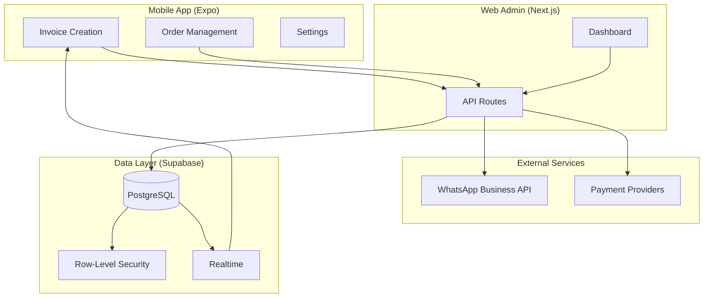

# Ojanaa: WhatsApp POS Super-App

## 1. Executive Summary

Ojanaa is a production-grade WhatsApp-native transaction platform designed for emerging markets. It solves the trust problem in informal commerce through an **Invoice Trust Loop**: merchants create invoices, customers receive and pay via WhatsApp, and both parties receive cryptographic proof of the transaction.

**Stack:** TypeScript, React Native, Expo, Next.js, Supabase, PostgreSQL, WhatsApp Business API

**Status:** Active development with phase-gated milestones

---

## 2. The Pain Point

Small merchants in Ghana and similar markets face multiple challenges:

1. **No affordable POS:** Traditional hardware and software is expensive and complex
2. **WhatsApp is ubiquitous:** But there's no production-grade commerce layer for it
3. **Trust is low:** Customers dispute payments, merchants have no proof of delivery
4. **Informal transactions lack receipts:** No audit trail for either party

The result: merchants lose sales because customers don't trust them, and customers avoid merchants because there's no recourse if something goes wrong.

---

## 3. The Solution

Ojanaa provides a **Trust Protocol** that creates verifiable, tamper-evident transaction records:

```
Invoice → Payment → Confirmation → Receipt
   ↓         ↓          ↓           ↓
Merchant   Customer   Merchant    Both
 creates   pays via   confirms    receive
 invoice   MoMo/card  receipt     proof
```

**Key capabilities:**
- Mobile app for merchants to create and manage invoices
- WhatsApp delivery of invoices to customers
- Payment integration (Mobile Money, cards)
- Mutual confirmation flow
- Receipt generation with verification

---

## 4. Architecture



**Key architectural decisions:**
- **Single backend surface:** All API routes live in `apps/web/src/app/api/*`—no separate API service
- **Monorepo structure:** `apps/web`, `apps/app`, `supabase/` in one repository
- **Real-time subscriptions:** Supabase Realtime for instant updates to mobile app

See [full architecture diagram](../architecture/ojanaa-system.md)

---

## 5. Key Engineering Decisions

### Phase-Gated Development
**Decision:** No Phase 2 features until Phase 1 passes all quality gates

**Tradeoff:** Slower feature velocity in exchange for solid foundation

**Rationale:** Prevents scope creep, ensures the invoice trust loop actually works before adding logistics, booking, or other features

### Idempotent Webhook Handlers
**Decision:** All webhook handlers and payment flows are retry-safe

**Tradeoff:** More complex handler logic, but bulletproof reliability

**Rationale:** WhatsApp and payment providers will retry. Double-processing a payment is catastrophic.

### Single Backend Surface
**Decision:** All API routes in Next.js App Router, not a separate API service

**Tradeoff:** Tighter coupling between web admin and API

**Rationale:** Reduces operational complexity. One deployment, one monitoring surface, one set of logs.

### Row-Level Security by Default
**Decision:** Every database table has RLS policies scoped to organization

**Tradeoff:** More complex SQL, stricter testing requirements

**Rationale:** Defense in depth. Even if application code has bugs, data can't leak across organizations.

---

## 6. Security & Privacy

### Authentication & Authorization
- Supabase Auth for user management
- Organization-scoped data isolation
- API route middleware validates session before any data access

### Row-Level Security (RLS)
- All tables protected by RLS policies
- Policies enforce organization scope: users can only access their org's data
- RLS audit matrix maintained in documentation

### Secrets Management
- All secrets in environment variables
- No hardcoded credentials in codebase
- Webhook signature verification for all inbound requests

### Threat Model Considerations
- WhatsApp message tampering: mitigated by server-side state, not client claims
- Payment replay: mitigated by idempotency keys
- Cross-org data access: mitigated by RLS

---

## 7. Reliability & Ops

### Quality Gates
Each phase has explicit acceptance criteria:
- Phase 0: Webhook verifies, logs write safely, CI green
- Phase 1: Invoice Trust Loop E2E functional
- Phase 2: Smart Scan & Tracking stable
- Phase 3: Booking logic correct

### Runbooks
10+ operational runbooks covering:
- Incident response procedures
- Deployment processes
- Database maintenance
- WhatsApp integration troubleshooting

### CI/CD
- GitHub Actions CI on every PR
- Automated testing
- Deployment pipelines with verification steps

### Monitoring
- Structured logging throughout
- Error tracking
- Real-time alerts for critical paths (payment processing)

---

## 8. Performance & Scalability

### Current Optimizations
- Database indexes on frequently queried columns
- Efficient RLS policies (no N+1 security checks)
- Supabase connection pooling

### Bottleneck Awareness
- WhatsApp API rate limits: handled with queuing
- Payment provider latency: async processing with status updates
- Mobile app startup: lazy loading, minimal initial payload

### Scalability Path
- Supabase handles horizontal scaling
- Stateless API routes scale with deployment
- WhatsApp Business API tier upgrades as volume grows

---

## 9. Impact & Metrics

| Metric | Value |
|--------|-------|
| Lines of TypeScript | 1.55M+ |
| Database procedures (PLpgSQL) | 630K+ |
| Active issues tracked | 72 |
| Runbooks maintained | 10+ |
| Documentation files | 50+ |
| CI workflows | Active |

*Note: Revenue and transaction metrics are confidential*

---

## 10. Demo

### Invoice Creation Flow (Mobile)

The merchant creates an invoice with customer details, products, and amounts. The interface is optimized for quick entry on mobile devices.

```
┌─────────────────────────────────┐
│  New Invoice                    │
├─────────────────────────────────┤
│  Customer: Kwame Asante         │
│  Phone: +233 XX XXX XXXX        │
│                                 │
│  Items:                         │
│  ├─ Widget Pro     GHS 100.00   │
│  └─ Service Fee    GHS  50.00   │
│                                 │
│  Total:            GHS 150.00   │
│                                 │
│  [Send via WhatsApp]            │
└─────────────────────────────────┘
```

### WhatsApp Trust Loop

```
┌─────────────────────────────────┐
│  WhatsApp                       │
├─────────────────────────────────┤
│  Accra Demo Store               │
│                                 │
│  📄 Invoice INV-DEMO-001        │
│                                 │
│  Items:                         │
│  • Widget Pro - GHS 100.00      │
│  • Service Fee - GHS 50.00      │
│                                 │
│  Total: GHS 150.00              │
│                                 │
│  [Pay Now] [View Details]       │
│                                 │
│  ─────────────────────────────  │
│                                 │
│  ✅ Payment Confirmed           │
│  Receipt: REC-DEMO-001          │
│  Thank you for your purchase!   │
└─────────────────────────────────┘
```

---

## 11. What I'd Improve Next

1. **Offline-first mobile:** Queue transactions locally when connectivity is poor
2. **Multi-currency support:** Handle USD, EUR alongside GHS
3. **Analytics dashboard:** Transaction trends, customer insights
4. **Bulk invoice operations:** For merchants with high volume
5. **API for integrations:** Allow third-party systems to create invoices

---

## 12. Repo Access Note

The core implementation of Ojanaa is in a **private repository** to protect intellectual property and business logic.

This case study and the [ojanaa-docs](https://github.com/iamnortey/ojanaa-docs) repository contain:
- Architecture documentation
- Engineering decision records
- Operational runbooks (sanitized)
- Demo screenshots (with synthetic data)

For code samples or technical deep-dives, please reach out directly.
