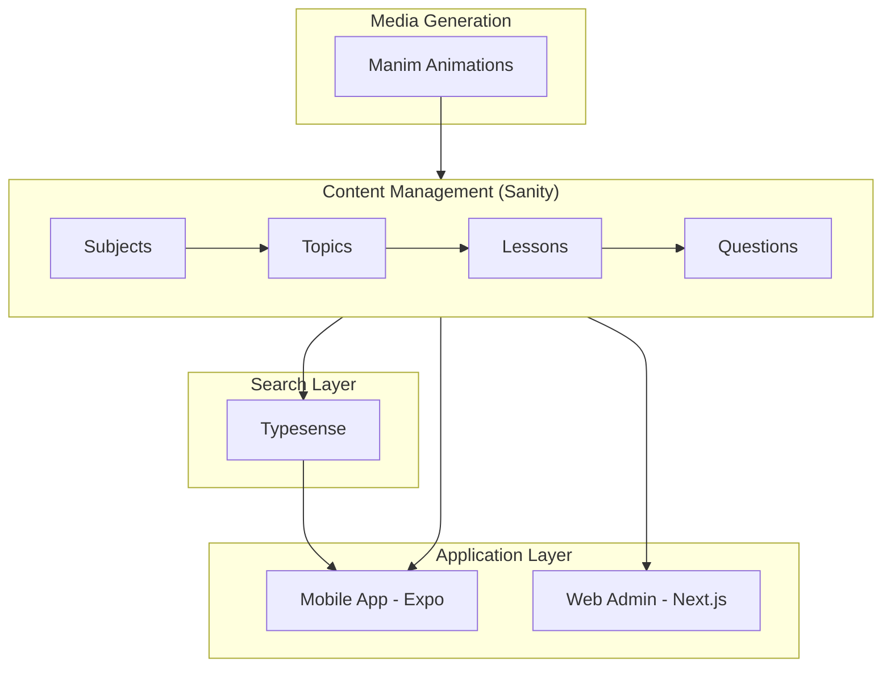

# Prepnest: Educational Content Platform

## 1. Executive Summary

Prepnest is a structured content platform for WASSCE/BECE exam preparation, built with a schema-first approach to educational content modeling. It powers search, analytics, and adaptive learning through a well-designed content hierarchy.

**Stack:** React Native, Expo, Next.js, Sanity CMS, PostgreSQL, Manim

**Status:** Development phase

---

## 2. The Pain Point

Students preparing for standardized exams in Ghana face challenges:

1. **Fragmented content:** Study materials scattered across textbooks, notes, and random websites
2. **No structured curriculum:** Hard to know what to study next
3. **Passive learning:** Static PDFs and videos don't adapt to student needs
4. **Visual concepts:** Math and science concepts are hard to understand without animation

---

## 3. The Solution

Prepnest provides a **structured content pipeline**:

```
Subject → Topic → Lesson → Question
   ↓        ↓        ↓         ↓
 Math    Algebra  Quadratic  Practice
                  Equations   Problems
```

**Key capabilities:**
- Hierarchical content organization
- Animated explanations via Manim
- Search-driven discovery (Typesense)
- Progress tracking

---

## 4. Architecture



---

## 5. Key Engineering Decisions

### Headless CMS (Sanity)
**Decision:** Use Sanity for content management rather than custom CMS

**Tradeoff:** Less control over editing experience, but faster development

**Rationale:** Sanity's schema-first approach matches our content hierarchy needs. Real-time collaboration for content editors.

### Schema-First Content Modeling
**Decision:** Define Subject → Topic → Lesson → Question hierarchy before building UI

**Tradeoff:** Upfront design work, less flexibility for ad-hoc content

**Rationale:** Educational content has natural structure. Encoding it in the schema prevents chaos.

### Manim for Animations
**Decision:** Use Manim (3Blue1Brown's library) for animated math explanations

**Tradeoff:** Python dependency, requires technical skill to create content

**Rationale:** Best-in-class math visualization. Students understand concepts better with animation.

---

## 6. Security & Privacy

- Standard web application security
- User authentication for progress tracking
- Content access controls (free vs. premium)
- No PII beyond basic user accounts

---

## 7. Reliability & Ops

- Sanity handles CMS reliability
- Typesense for fast, reliable search
- Mobile app designed for offline-first where possible
- Content versioning via Sanity

---

## 8. Impact & Metrics

| Metric | Value |
|--------|-------|
| Animation templates | 533K+ lines Python |
| Content schema | Defined |
| Documentation | Design system + UI overview |

---

## 9. Demo

### Content Hierarchy

```
Mathematics (Subject)
├── Algebra (Topic)
│   ├── Linear Equations (Lesson)
│   │   ├── Introduction [Video + Animation]
│   │   ├── Worked Examples
│   │   └── Practice Questions (5)
│   └── Quadratic Equations (Lesson)
│       ├── Introduction [Video + Animation]
│       ├── Factoring Method
│       ├── Quadratic Formula
│       └── Practice Questions (10)
└── Geometry (Topic)
    └── ...
```

### Sanity Schema Example

```javascript
// Subject schema
{
  name: 'subject',
  title: 'Subject',
  type: 'document',
  fields: [
    { name: 'title', type: 'string' },
    { name: 'slug', type: 'slug' },
    { name: 'description', type: 'text' },
    { name: 'icon', type: 'image' },
    { name: 'topics', type: 'array', of: [{ type: 'reference', to: [{ type: 'topic' }] }] }
  ]
}
```

---

## 10. What I'd Improve Next

1. **Adaptive learning:** Recommend content based on student performance
2. **Offline mode:** Full offline access for students with unreliable internet
3. **Analytics dashboard:** Insights for teachers and content creators
4. **Community features:** Discussion forums, study groups

---

## 11. Repo Access Note

The core implementation of Prepnest is in **private repositories** to protect educational content and business logic.

The open-source [sanity-education-starter](https://github.com/iamnortey/sanity-education-starter) demonstrates the schema patterns used.

This case study and the [prepnest-docs](https://github.com/iamnortey/prepnest-docs) repository contain:
- Content modeling documentation
- Design system documentation
- Architecture overview

For collaboration inquiries, please reach out directly.
