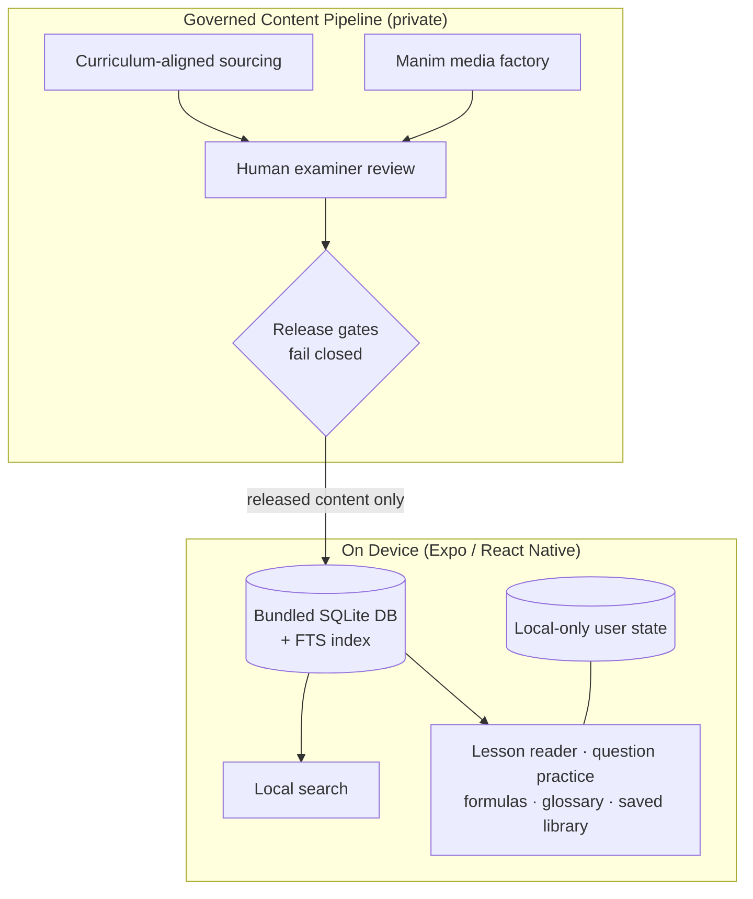

# Prepnest: Offline-First WASSCE Study OS

## 1. Executive Summary

Prepnest is a mobile study companion for students preparing for the WASSCE in Ghana, built as an **offline-first Study OS**: the study library, search, and all personal study state live on the device. The engineering story is about three disciplines working together — local-first architecture, a governed content pipeline with human review gates, and an honesty-first product voice enforced by automated checks.

**Stack:** Expo, React Native, TypeScript, SQLite (bundled, full-text search), Manim
**Status:** Private, pre-release (internal alpha). Prepnest is an independent product — not affiliated with or endorsed by WAEC.

---

## 2. The Pain Point

Students preparing for the WASSCE face a stacked set of constraints:

1. **Connectivity and data cost.** Reliable internet is not a given; mobile data is a real expense. A study tool that needs the network every session gets abandoned.
2. **Fragmented material.** Study content is scattered across textbooks, notes, and unvetted websites of uneven quality.
3. **Trust.** Exam preparation is high stakes. Wrong answers, fake availability, and unverified material are worse than nothing.
4. **Hard-to-visualize concepts.** Math and science topics need motion and diagrams, not another static PDF.

---

## 3. The Solution

An app whose entire study loop works in airplane mode, fed only by content that has cleared human review:

- **Bundled study library** — lessons, practice questions, formulas, and glossary ship inside the app in a local SQLite database.
- **Local full-text search** — search-first navigation over the whole library with zero network calls.
- **Reader-grade study surfaces** — a typographic lesson reader with highlights, private notes, bookmarks; practice questions with "try first / answer / full solution" modes.
- **Local-only user state** — study history, saved items, and preferences stay on the phone; no account is required to study.
- **Animated explanations** — math/science visuals produced in a dedicated Manim studio and imported through the same governed pipeline as text.

---

## 4. Architecture

---

## 5. Key Engineering Decisions

### Offline-first with a bundled database
**Decision:** ship the content corpus and its search index inside the app instead of serving from the cloud.
**Tradeoff:** bigger install size and content updates ride app releases — accepted, because the alternative (per-session data cost) fails the market.
**Result:** every study feature works without connectivity; data cost after install is effectively zero.

### Content governance as executable gates
**Decision:** model content trust in the pipeline itself — every item carries sourcing and review status, and release validation **fails closed**: unreviewed content structurally cannot reach a release build.
**Tradeoff:** slower content velocity than "just import it".
**Result:** the app can honestly claim that everything a student sees passed human review — the core trust promise of the product.

### Honesty-first UX, pinned by tests
**Decision:** the interface never fakes availability — unreleased papers say "being prepared", missing narration says so, and a public-exam countdown renders only when the official date is confirmed. A smoke-script suite pins this copy and behavior so regressions fail CI, not students.
**Tradeoff:** the app sometimes admits it has less than a marketing screenshot would show.
**Result:** product truthfulness became testable, not aspirational.

### A media factory, not inline assets
**Decision:** produce math/science animations in a separate private Manim studio with its own design system, entering the app only through the review pipeline.
**Tradeoff:** more moving parts than dropping images into the repo.
**Result:** visual explanations get the same governance and quality bar as text.

### Clean-cut repository for the release line
**Decision:** cut the release-candidate app into a standalone repository with a fresh history, separating it from years of prototype iterations (including a retired Sanity CMS + hosted-search generation).
**Result:** a reviewable, governable release line; the earlier architecture survives publicly as the open-source [sanity-education-starter](https://github.com/iamnortey/sanity-education-starter).

---

## 6. What This Case Study Demonstrates

- **Local-first engineering** under real emerging-market constraints (connectivity, data cost, device range).
- **Governance as architecture** — human review and release gates expressed in code, not policy documents.
- **Product honesty as a testable property** — copy and availability claims pinned by an automated smoke suite.
- **Multi-repo production discipline** — app, content pipeline, and media factory as separately governed private workspaces with a curated public documentation surface.

---

## 7. Current Status

Private, pre-release internal alpha. Public distribution is deliberately gated on completed examiner review, release-owner sign-off, and store/privacy readiness. Architecture docs live at [prepnest-docs](https://github.com/iamnortey/prepnest-docs); deeper walkthroughs are available on request.
